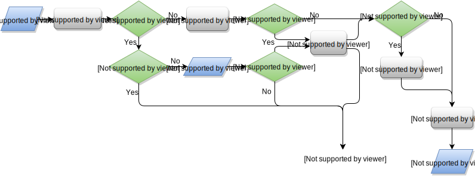

.. |br| raw:: html

    

.. _ref-assemble:

Assemble clones
===============

The ``assemble`` command builds clonotypes from alignments obtained with :ref:`align <ref-align>`. Clonotypes assembly is performed for a chosen assembling feature (e.g. ``CDR3`` by default).

The syntax is the following:

::

    mixcr assemble [options] alignments.vdjca output.clns

or

::

    mixcr assemble [options] -a alignments.vdjca output.clna

the latter command outputs result in a "clones & alignments" format, allowing subsequent :ref:`contig assembly <ref-assembleContigs>` and other actions requiring clone to alignment mapping (e.g. ).

The following flowchart shows the pipeline of ``assemble``:

This pipeline consists of the following steps:

1.  The assembler sequentially processes records (aligned reads) from
    input ``.vdjca`` file produced by :ref:`align <ref-align>`. On the
    first step, assembler tries to extract gene feature sequences from
    aligned reads (called *clonal sequence*) specified by
    ``assemblingFeatures`` parameter (``CDR3`` by default); the
    clonotypes are assembled with respect to *clonal sequence*. If
    aligned read does not contain clonal sequence (e.g. ``CDR3`` region),
    it will be dropped.

2.  If clonal sequence contains at least one nucleotide with low quality
    (less than ``badQualityThreshold`` parameter value), then this record
    will be deferred for further processing by *mapping procedure*. If
    fraction of low quality nucleotides in deferred record is greater than
    ``maxBadPointsPercent`` parameter value, then this record will be
    finally dropped. Records with clonal sequence containing only good
    quality nucleotides are used to build core clonotypes by grouping
    records by equality of clonal sequences (e.g. CDR3). The sequence quality
    of the resulting core clonotype will be equal to the total of qualities of the 
    assembled reads. Each core clonotype has two main properties: clonal 
    sequence and ``count`` --- a number of records aggregated by this clonotype.

3.  After the core clonotypes are built, MiXCR runs *mapping procedure*
    that processes records deferred on the previous step. *Mapping* is
    aimed on rescuing of quantitative information from low quality reads.
    For this, each deferred record is mapped onto already assembled
    clonotypes: if there is a fuzzy match, then this record will be
    aggregated by the corresponding clonotype; in case of several matched
    clonotypes, a single one will be randomly chosen with weights equal
    to clonotype counts. If no matches found, the record will be finally
    dropped.

4.  After clonotypes are assembled by initial assembler and mapper, MiXCR
    proceeds to *clustering*. The clustering algorithm tries to find
    fuzzy matches between clonotypes and organize matched clonotypes in
    hierarchical tree (*cluster*), where each child layer is highly
    similar to its parent but has significantly smaller ``count``. Thus,
    clonotypes with small counts will be attached to highly similar
    "parent" clonotypes with significantly greater count. The typical
    cluster looks as follows:

    .. figure:: _static/Cluster.svg

    After all clusters are built, only their heads are considered as
    final clones. The maximal depths of cluster, fuzzy matching criteria,
    relative counts of parent/childs and other parameters can be
    customized using ``clusteringStrategy`` parameters described below.

5.  The final step is to align clonal sequences to reference V,D,J and C
    genes. Since the ``assemblingFeatures`` are different from those used
    in ``align``, it is necessary to rebuild alignments for clonal
    sequences. This alignments are built by more accurate aligner (since
    all hits are known in advance); thus, better alignments will be built
    for each clonal sequence.

6.  The result is written to the binary output file (``.clns``) with a
    comprehensive information about clones.

Command line parameters
-----------------------

The command line options of ``assemble`` are the following:

+-------------------------------------+-------------------------------+--------------------------------------------------------------------------------+
| Option                              | Default value                 | Description                                                                    |
+=====================================+===============================+================================================================================+
| ``-h``, ``--help``                  |                               | Print help message.                                                            |
+-------------------------------------+-------------------------------+--------------------------------------------------------------------------------+
| ``-r {file}`` |br|                  |                               | Report file name. If this option is not specified, no report file be produced. |
| ``--report ...``                    |                               |                                                                                |
+-------------------------------------+-------------------------------+--------------------------------------------------------------------------------+
| ``-t {numberOfProcessors}`` |br|    | number of available CPU cores | Number of processing threads.                                                  |
| ``--threads ...``                   |                               |                                                                                |
+-------------------------------------+-------------------------------+--------------------------------------------------------------------------------+
| ``-i {indexFile}`` |br|             |                               | Specify file which will store information about particular reads aggreagated   |
| ``--index ...``                     |                               | by each clone (mapping readId -> cloneId).                                     |
+-------------------------------------+-------------------------------+--------------------------------------------------------------------------------+
| ``-Oparameter=value``               |                               | Overrides default value of assembler ``parameter`` (see next subsection).      |
+-------------------------------------+-------------------------------+--------------------------------------------------------------------------------+

All parameters are optional.

Assembler parameters
--------------------

MiXCR uses a wide range of parameters that controls assembler behaviour.
There are some global parameters and parameters organized in groups for
each stage of assembling: ``cloneClusteringParameters`` and
``cloneFactoryParameters``. Each group of parameters may contain further
subgroups of parameters etc. In order to override some parameter value
one can use ``-O`` followed by fully qualified parameter name and
parameter value (e.g. ``-Ogroup1.group2.parameter=value``).

One of the key MiXCR features is ability to assemble clonotypes by
sequence of custom :ref:`gene region <ref-geneFeatures>` (e.g. ``FR3+CDR3``);
target clonal sequence can even be disjoint. This region can be
specified by ``assemblingFeatures`` parameter, as in the following
example:

::

    mixcr assemble -OassemblingFeatures="[V5UTR+L1+L2+FR1,FR3+CDR3]" alignments.vdjca output.clns

(**note**: ``assemblingFeatures`` must cover ``CDR3``).

Other global parameters are:

+---------------------------------+-----------------+------------------------------------------------------------------------------------------+
| Parameter                       | Default value   | Description                                                                              |
+=================================+=================+==========================================================================================+
| ``minimalClonalSequenceLength`` |  ``12``         | Minimal length of clonal sequence                                                        |
+---------------------------------+-----------------+------------------------------------------------------------------------------------------+
| ``badQualityThreshold``         | ``20``          | Minimal value of sequencing quality score: nucleotides with lower quality are considered |
|                                 |                 | as "bad". If sequencing read contains at least one “bad” nucleotide within the target    |
|                                 |                 | gene region, it will be deferred at initial assembling stage, for further processing     |
|                                 |                 | by mapper.                                                                               |
+---------------------------------+-----------------+------------------------------------------------------------------------------------------+
| ``maxBadPointsPercent``         | ``0.7``         | Maximal allowed fraction of "bad" points in sequence: if sequence contains more than     |
|                                 |                 | ``maxBadPointsPercent`` "bad" nucleotides, it will be completely dropped                 |
|                                 |                 | and will not be used for further processing by mapper. Sequences with the allowed        |
|                                 |                 | percent of “bad” points will be mapped to the assembled core clonotypes.                 |
|                                 |                 | Set ``-OmaxBadPointsPercent=0`` in order to completely drop all sequences that           |
|                                 |                 | contain at least one “bad” nucleotide.                                                   |
+---------------------------------+-----------------+------------------------------------------------------------------------------------------+
| ``qualityAggregationType``      |  ``Max``        | Algorithm used for aggregation of total clonal sequence quality during assembling        |
|                                 |                 | of sequencing reads. Possible values:                                                    |
|                                 |                 | ``Max`` (maximal quality across all reads for each position),                            |
|                                 |                 | ``Min`` (minimal quality across all reads for each position),                            |
|                                 |                 | ``Average`` (average quality across all reads for each position),                        |
|                                 |                 | ``MiniMax`` (all letters has the same quality which is the maximum of minimal quality of |
|                                 |                 | clonal sequence in each read).                                                           |
+---------------------------------+-----------------+------------------------------------------------------------------------------------------+
| ``minimalQuality``              |  ``0``          | Minimal allowed quality of each nucleotide of assembled clone. If at least one           |
|                                 |                 | nucleotide in the assembled clone has quality lower than ``minimalQuality``, this clone  |
|                                 |                 | will be dropped (remember that qualities of reads are aggregated according to selected   |
|                                 |                 | aggregation strategy during core clonotypes assembly; see ``qualityAggregationType``).   |
+---------------------------------+-----------------+------------------------------------------------------------------------------------------+
| ``addReadsCountOnClustering``   | ``false``       | Aggregate cluster counts when assembling final clones: if ``addReadsCountOnClustering``  |
|                                 |                 | is ``true``, then all children clone counts will be added to the head clone; thus head   |
|                                 |                 | clone count will be a total of its initial count and counts of all its children.         |
|                                 |                 | Refers to further clustering strategy (see below). Does not refer to mapping of low      |
|                                 |                 | quality sequencing reads described above.                                                |
+---------------------------------+-----------------+------------------------------------------------------------------------------------------+

One can override these parameters in the following way:

::

    mixcr assemble -ObadQualityThreshold=10 alignments.vdjca output.clns

In order to prevent mapping of low quality reads (filter them off) one
can set ``maxBadPointsPercent`` to zero:

::

    mixcr assemble -OmaxBadPointsPercent=0 alignments.vdjca output.clns

Separation of clones with same CDR3 (clonal sequence) but different V/J/C genes
-------------------------------------------------------------------------------

Since v1.8 MiXCR can separates clones with equal clonal sequence and different V, J and C (e.g. do distinguish clones with different IG isotype) genes.

To make analysis more robust to sequencing errors there is an additional clustering step to shrink
artificial diversity generated by this separation mechanism.

The following criteria are used on this pre-clusterization step: more abondant clone (``clone1``) absorbs
smaller clone (``clone2``) if ``clone2.count < clone1.count * maximalPreClusteringRatio`` (``cloneX.count``
denotes number of reads in corresponding clone)and ``clone2`` contain top V/J/C gene from ``clone1`` in
it's corresponding gene list.

The following parameter control separation behaviour and pre-clusterization:

+---------------------------------------+---------------------------+------------------------------------------------------------+
| Parameter                             | Default value             | Description                                                |
+=======================================+===========================+============================================================+
| ``maximalPreClusteringRatio``         | ``1.0``                   | See conditions for clustering above for more inforamtion.  |
+---------------------------------------+---------------------------+------------------------------------------------------------+
| ``separateByV``                       | ``false``                 | If ``false`` clones with equal clonal sequence but         |
|                                       |                           | different V gene will be merged into single clone.         |
+---------------------------------------+---------------------------+------------------------------------------------------------+
| ``separateByJ``                       | ``false``                 | If ``false`` clones with equal clonal sequence but         |
|                                       |                           | different J gene will be merged into single clone.         |
+---------------------------------------+---------------------------+------------------------------------------------------------+
| ``separateByC``                       | ``false``                 | If ``false`` clones with equal clonal sequence but         |
|                                       |                           | different C gene will be merged into single clone.         |
+---------------------------------------+---------------------------+------------------------------------------------------------+

Example, in order to separate IG clones by isotypes use the following options:

::

    mixcr assemble -OseparateByC=true alignments.vdjca output.clns

Clustering strategy
--------------------

Parameters that control clustering procedure are placed in
``cloneClusteringParameters`` parameters group which determines the rules for the frequency-based correction of PCR and sequencing errors:

+---------------------------------------+---------------------------+------------------------------------------------------------+
| Parameter                             | Default value             | Description                                                |
+=======================================+===========================+============================================================+
| ``searchDepth``                       | ``2``                     | Maximum number of cluster layers (not including head).     |
+---------------------------------------+---------------------------+------------------------------------------------------------+
| ``allowedMutationsInNRegions``        | ``1``                     | Maximum allowed number of mutations in N regions           |
|                                       |                           | (non-template nucleotides in VD, DJ or VJ junctions): if   |
|                                       |                           | two fuzzy matched clonal sequences will contain more than  |
|                                       |                           | ``allowedMutationsInNRegions`` mismatches in N-regions,    |
|                                       |                           | they will not be clustered together (one cannot be a       |
|                                       |                           | direct child of another).                                  |
+---------------------------------------+---------------------------+------------------------------------------------------------+
| ``searchParameters``                  | ``twoMismatchesOrIndels`` | Parameters that control fuzzy match criteria between       |
|                                       |                           | clones in adjacent layers. Available predefined values:    |
|                                       |                           | ``oneMismatch``, ``oneIndel``, ``oneMismatchOrIndel``,     |
|                                       |                           | ``twoMismatches``, ``twoIndels``,                          |
|                                       |                           | ``twoMismatchesOrIndels``, ... ,                           |
|                                       |                           | ``fourMismatchesOrIndels``. By default,                    |
|                                       |                           | ``twoMismatchesOrIndels`` allows two mismatches or indels  |
|                                       |                           | (not more than two errors of both types) between two       |
|                                       |                           | adjacent clones (parent and direct child).                 |
+---------------------------------------+---------------------------+------------------------------------------------------------+
| ``clusteringFilter``                  | ``1E-3``                  | Probability of a single nucleotide mutation in clonal      |
| ``.specificMutationProbability``      |                           | sequence which has non-hypermutation origin (i.e. PCR or   |
|                                       |                           | sequencing error). This parameter controls relative counts |
|                                       |                           | between two clones in adjacent layers: a smaller clone can |
|                                       |                           | be attached to a larger one if its count smaller than      |
|                                       |                           | count of parent multiplied by                              |
|                                       |                           | ``(clonalSequenceLength * specificMutationProbability)``   |
|                                       |                           | ``^ numberOfMutations``.                                   |
+---------------------------------------+---------------------------+------------------------------------------------------------+

One can override these parameters in the following way:

::

    mixcr assemble -OcloneClusteringParameters.searchParameters=oneMismatchOrIndel alignments.vdjca output.clns

In order to turn off clustering one should use the following parameters:

::

    mixcr assemble -OcloneClusteringParameters=null alignments.vdjca output.clns

.. Clone factory parameters
.. ------------------------

.. Parameters which control final alignment of clonal sequences are placed in ``cloneFactoryParameters`` group. These parameters includes separate groups for V, D, J and C aligners: ``vParameters``, ``dParameters``, ``jParameters`` and ``cParameters``. The D aligner is the same as used in ``align`` and thus all its parameters and their default values are the same as described for :ref:`D aligner in align <ref-dAlignerParameters>`. One can override these parameters in the following way:

.. 

..     mixcr assemble -OcloneFactoryParameters.dParameters.absoluteMinScore=10 alignments.vdjca output.clns

.. 

..     mixcr assemble -OcloneFactoryParameters.dParameters.scoring.gapOpenPenalty=-10 alignments.vdjca output.clns

.. The aligners used to build alignments with V, J and C genes are different from those used by ``align``.

.. The scoring parameters are placed in group ``alignmentParameters.scoring``:

.. +-------------------------+----------------------------------------+--------------------------------------------------------------------+
.. | Parameter               | Default value (same for V, J, C)       | Description                                                        |
.. +=========================+========================================+====================================================================+
.. | ``subsMatrix``          | ``simple(match = 5,``                  | Substitution matrix. Available types:                              |
.. |                         |  ``mismatch = -9)``                    |                                                                    |
.. |                         |                                        |  - ``simple`` --- a matrix with diagonal elements equal to         |
.. |                         |                                        |    ``match`` and other elements equal to ``mismatch``              |
.. |                         |                                        |  - ``raw`` --- a complete set of 16 matrix elements should be      |
.. |                         |                                        |    specified; for  example:                                        |
.. |                         |                                        |    ``raw(5,-9,-9,-9,-9,5,-9,-9,-9,-9,5,-9,-9,-9,-9,5)``            |
.. |                         |                                        |     (*equivalent to the default value*)                            |
.. +-------------------------+----------------------------------------+--------------------------------------------------------------------+
.. | ``gapPenalty``          | ``-12``                                | Penalty for gap.                                                   |
.. +-------------------------+----------------------------------------+--------------------------------------------------------------------+

.. One can override these parameters in the following way

.. 

..     mixcr assemble -OcloneFactoryParameters.vParameters.alignmentParameters.scoring.gapPenalty=-5 \
..                    alignments.vdjca output.clns
