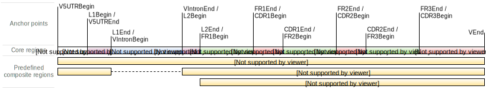
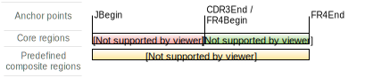
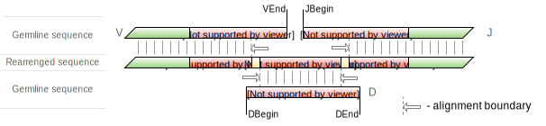
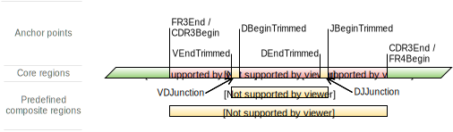

.. _ref-geneFeatures:
 
Gene features and anchor points
===============================

There are several immunologically important parts of TCR/BCR gene
(**gene features**). For example, such regions are three complementarity
determining regions (``CDR1``, ``CDR2`` and ``CDR3``), four framework
regions (``FR1``, ``FR2``, ``FR3`` and ``FR4``) etc.

The key feature of MiXCR is the possibility to specify:

-  regions of reference V, D, J and C genes sequences that are used in
   :ref:`alignment of raw reads <ref-align>`
-  regions of sequence to be exported by
   :ref:`exportAlignments <ref-export>`
-  regions of sequence to use as clonal sequence in :ref:`clone assembly <ref-assemble>`
-  regions of clonal sequences to be exported by
   :ref:`exportClones <ref-export>`

For convenience, in MiXCR these regions can be specified in terms of
above mentioned immunological gene features. The illustrated list of
predefined gene features can be found below. The set of possible gene
regions is not limited by this list:

-  boundary points of gene features (called **anchor points**) can be
   used to specify begin and end of custom gene regions
-  gene features can be concatenated (e.g. VTranscript =
   {V5UTRBegin:L1End}+{L2Begin:VEnd}).
-  offsets can be added or subtracted from original positions of
   **anchor points** to define even more custom gene regions (for more
   detailed description see :ref:`gene feature syntax <ref-featureSyntax>`)

Naming of gene features is based on IMGT convention described in
*Lefranc et al. (2003), Developmental & Comparative Immunology 27.1 (2003): 55-77*.

Germline features
-----------------

Features defined for germline genes are mainly used in
:ref:`align <ref-align>` and :ref:`export <ref-export>`.

V Gene structure
~~~~~~~~~~~~~~~~

Additionally to core gene features in V region (like ``FR3``) we
introduce ``VGene``, ``VTranscript`` and ``VRegion`` for convenience.

D Gene structure
~~~~~~~~~~~~~~~~

J Gene structure
~~~~~~~~~~~~~~~~

Mature TCR/BCR gene features
----------------------------

Features described here (like ``CDR3``) cannot not be used for
:ref:`align <ref-align>`, since they are not defined for germline genes.

V(D)J junction structure
~~~~~~~~~~~~~~~~~~~~~~~~

Important difference between rearranged TCR/BCR sequence and germline
sequence of its segments lies in the fact that during V(D)J
recombination exact cleavage positions at the end of V gene, begin and
end of D gene and begin of J gene varies. As a result in most cases
actual ``VEnd``, ``DBegin``, ``DEnd`` and ``JBegin`` anchor positions
are not covered by alignment:

In order to use actual V, D, J gene boundaries we introduce four
additional anchor positions: ``VEndTrimmed``, ``DBeginTrimmed``,
``DEndTrimmed`` and ``JBeginTrimmed`` and several named gene features:
``VDJunction``, ``DJJunction`` and ``VJJunction``. On the following
picture one can see the structure of V(D)J junction:

If D gene is not found in the sequence or is not present in target locus
(e.g. TRA), ``DBeginTrimmed`` and ``DEndTrimmed`` anchor points as well
as ``VDJunction`` and ``DJJunction`` gene features are not defined.

Similar to ``...Trimmed`` anchor points in V(D)J junction there is a 
``V5UTRBeginTrimmed`` anchor point representing left bound of alignment
upstream start codon. This point is required because 5'UTR could have
different length from transcript to transcript, and because library of 
gene segments inside MiXCR does'n have information on exact 5'UTR lengths.

.. _ref-featureSyntax:

Gene feature syntax
-------------------

Syntax for gene features is the same everywhere. The best way to explain
it is by example:

-  to enter any gene feature mentioned above or listed in the next
   section just use its name: ``VTranscript``, ``CDR2``, ``V5UTR`` etc.
-  to define a gene feature consisting of several concatenated features
   use ``+``: ``V5UTR+L1+L2+VRegion`` is equivalent to ``VTranscript``
-  to create gene feature starting at anchor point ``X`` and ending at
   anchor point ``Y`` use {X:Y} syntax: ``{CDR3Begin:CDR3End}`` for
   ``CDR3``.
-  one can add or subtract offset from original position of anchor point
   using positive or negative integer value in brackets after anchor
   point name AnchorPoint(offset): ``{CDR3Begin(+3):CDR3End}`` for
   ``CDR3`` without first three nucleotides (coding conserved cysteine),
   ``{CDR3Begin(-6):CDR3End(+6)}`` for ``CDR3`` with 6 nucleotides
   downstream its left bound and 6 nucleotides upstream its right bound.
-  one can specify offsets for predefined gene feature boundaries using
   GeneFeatureName(leftOffset, rightOffset) syntax: ``CDR3(3,0)``,
   ``CDR3(-6,6)`` - equivalents of two examples from previous item
-  all syntax constructs can be combined:
   ``{L1Begin(-12):L1End}+L2+VRegion(0,+10)}``.

List of predefined gene features
--------------------------------

+---------------------------------+-------------------------------------------------------------------+-------------------------------------------------------------------------------------------------------------------------------------------------------------------------------+
| Gene Feature Name               | Gene feature decomposition                                        | Documentation                                                                                                                                                                 |
+=================================+===================================================================+===============================================================================================================================================================================+
| ``V5UTRGermline``               | ``{UTR5Begin:V5UTREnd}``                                          | 5'UTR; germline                                                                                                                                                               |
+---------------------------------+-------------------------------------------------------------------+-------------------------------------------------------------------------------------------------------------------------------------------------------------------------------+
| ``VTranscript``                 | ``{UTR5Begin:L1End}`` + ``{L2Begin:VEnd}``                        | ``V5UTR`` + ``Exon1`` + ``VExon2``. Common reference feature used in alignments for cDNA data obtained using 5'RACE (that may contain UTRs).                                  |
+---------------------------------+-------------------------------------------------------------------+-------------------------------------------------------------------------------------------------------------------------------------------------------------------------------+
| ``VGene``                       | ``{UTR5Begin:VEnd}``                                              | ``{V5UTRBegin:VEnd}``. Common reference feature used in alignments for genomic DNA data.                                                                                      |
+---------------------------------+-------------------------------------------------------------------+-------------------------------------------------------------------------------------------------------------------------------------------------------------------------------+
| ``VTranscriptWithP``            | ``{UTR5Begin:L1End}`` + ``{L2Begin:VEnd}`` + ``{VEnd:VEnd(-20)}`` | ``V5UTR`` + ``Exon1`` + ``VExon2``. Common reference feature used in alignments for cDNA data obtained using 5'RACE (that may contain UTRs). Contains reference for P region. |
+---------------------------------+-------------------------------------------------------------------+-------------------------------------------------------------------------------------------------------------------------------------------------------------------------------+
| ``VGeneWithP``                  | ``{UTR5Begin:VEnd}`` + ``{VEnd:VEnd(-20)}``                       | ``{V5UTRBegin:VEnd}``. Common reference feature used in alignments for genomic DNA data. Contains reference for P region.                                                     |
+---------------------------------+-------------------------------------------------------------------+-------------------------------------------------------------------------------------------------------------------------------------------------------------------------------+
| ``VDJTranscript``               | ``{UTR5Begin:L1End}`` + ``{L2Begin:FR4End}``                      | First two exons with 5'UTR of IG/TCR gene.                                                                                                                                    |
+---------------------------------+-------------------------------------------------------------------+-------------------------------------------------------------------------------------------------------------------------------------------------------------------------------+
| ``V5UTR``                       | ``{V5UTRBeginTrimmed:V5UTREnd}``                                  | 5'UTR in aligned sequence; trimmed                                                                                                                                            |
+---------------------------------+-------------------------------------------------------------------+-------------------------------------------------------------------------------------------------------------------------------------------------------------------------------+
| ``L1``                          | ``{L1Begin:L1End}``                                               | Part of lider sequence in first exon. The same as ``Exon1``.                                                                                                                  |
+---------------------------------+-------------------------------------------------------------------+-------------------------------------------------------------------------------------------------------------------------------------------------------------------------------+
| ``VLIntronL``                   | ``{L1Begin:L2End}``                                               | ``L1`` + ``VIntron`` + ``L2``                                                                                                                                                 |
+---------------------------------+-------------------------------------------------------------------+-------------------------------------------------------------------------------------------------------------------------------------------------------------------------------+
| ``Exon1``                       | ``{L1Begin:L1End}``                                               | First exon. The same as ``L1``.                                                                                                                                               |
+---------------------------------+-------------------------------------------------------------------+-------------------------------------------------------------------------------------------------------------------------------------------------------------------------------+
| ``L``                           | ``{L1Begin:L1End}`` + ``{L2Begin:L2End}``                         | Full leader sequence                                                                                                                                                          |
+---------------------------------+-------------------------------------------------------------------+-------------------------------------------------------------------------------------------------------------------------------------------------------------------------------+
| ``VTranscriptWithout5UTR``      | ``{L1Begin:L1End}`` + ``{L2Begin:VEnd}``                          | ``Exon1`` + ``VExon2``. Common reference feature used in alignments for mRNA data obtained without 5'RACE.                                                                    |
+---------------------------------+-------------------------------------------------------------------+-------------------------------------------------------------------------------------------------------------------------------------------------------------------------------+
| ``VTranscriptWithout5UTRWithP`` | ``{L1Begin:L1End}`` + ``{L2Begin:VEnd}`` + ``{VEnd:VEnd(-20)}``   | ``Exon1`` + ``VExon2``. Common reference feature used in alignments for mRNA data obtained without 5'RACE. Contains reference for P region.                                   |
+---------------------------------+-------------------------------------------------------------------+-------------------------------------------------------------------------------------------------------------------------------------------------------------------------------+
| ``VDJTranscriptWithout5UTR``    | ``{L1Begin:L1End}`` + ``{L2Begin:FR4End}``                        | First two exons of IG/TCR gene.                                                                                                                                               |
+---------------------------------+-------------------------------------------------------------------+-------------------------------------------------------------------------------------------------------------------------------------------------------------------------------+
| ``VIntron``                     | ``{VIntronBegin:VIntronEnd}``                                     | Intron in V region.                                                                                                                                                           |
+---------------------------------+-------------------------------------------------------------------+-------------------------------------------------------------------------------------------------------------------------------------------------------------------------------+
| ``L2``                          | ``{L2Begin:L2End}``                                               | Part of lider sequence in second exon.                                                                                                                                        |
+---------------------------------+-------------------------------------------------------------------+-------------------------------------------------------------------------------------------------------------------------------------------------------------------------------+
| ``Exon2``                       | ``{L2Begin:FR4End}``                                              | Full second exon of IG/TCR gene.                                                                                                                                              |
+---------------------------------+-------------------------------------------------------------------+-------------------------------------------------------------------------------------------------------------------------------------------------------------------------------+
| ``VExon2``                      | ``{L2Begin:VEnd}``                                                | Second exon of V gene.                                                                                                                                                        |
+---------------------------------+-------------------------------------------------------------------+-------------------------------------------------------------------------------------------------------------------------------------------------------------------------------+
| ``VExon2Trimmed``               | ``{L2Begin:VEndTrimmed}``                                         | Second exon of V gene trimmed. Ends within CDR3 in V(D)J rearrangement.                                                                                                       |
+---------------------------------+-------------------------------------------------------------------+-------------------------------------------------------------------------------------------------------------------------------------------------------------------------------+
| ``VRegion``                     | ``{FR1Begin:VEnd}``                                               | Full V Region; germline                                                                                                                                                       |
+---------------------------------+-------------------------------------------------------------------+-------------------------------------------------------------------------------------------------------------------------------------------------------------------------------+
| ``VRegionWithP``                | ``{FR1Begin:VEnd}`` + ``{VEnd:VEnd(-20)}``                        | Full V Region with P-segment; to be used as alignment reference                                                                                                               |
+---------------------------------+-------------------------------------------------------------------+-------------------------------------------------------------------------------------------------------------------------------------------------------------------------------+
| ``VRegionTrimmed``              | ``{FR1Begin:VEndTrimmed}``                                        | Full V Region in rearranged sequence, e.g. after trimming                                                                                                                     |
+---------------------------------+-------------------------------------------------------------------+-------------------------------------------------------------------------------------------------------------------------------------------------------------------------------+
| ``FR1``                         | ``{FR1Begin:FR1End}``                                             | Framework 1                                                                                                                                                                   |
+---------------------------------+-------------------------------------------------------------------+-------------------------------------------------------------------------------------------------------------------------------------------------------------------------------+
| ``VDJRegion``                   | ``{FR1Begin:FR4End}``                                             | Full V, D, J assembly without 5'UTR and leader sequence.                                                                                                                      |
+---------------------------------+-------------------------------------------------------------------+-------------------------------------------------------------------------------------------------------------------------------------------------------------------------------+
| ``CDR1``                        | ``{CDR1Begin:CDR1End}``                                           | CDR1 (Complementarity determining region 1)                                                                                                                                   |
+---------------------------------+-------------------------------------------------------------------+-------------------------------------------------------------------------------------------------------------------------------------------------------------------------------+
| ``FR2``                         | ``{FR2Begin:FR2End}``                                             | Framework 2                                                                                                                                                                   |
+---------------------------------+-------------------------------------------------------------------+-------------------------------------------------------------------------------------------------------------------------------------------------------------------------------+
| ``CDR2``                        | ``{CDR2Begin:CDR2End}``                                           | CDR2 (Complementarity determining region 2)                                                                                                                                   |
+---------------------------------+-------------------------------------------------------------------+-------------------------------------------------------------------------------------------------------------------------------------------------------------------------------+
| ``FR3``                         | ``{FR3Begin:FR3End}``                                             | Framework 2                                                                                                                                                                   |
+---------------------------------+-------------------------------------------------------------------+-------------------------------------------------------------------------------------------------------------------------------------------------------------------------------+
| ``CDR3``                        | ``{CDR3Begin:CDR3End}``                                           | CDR3 (Complementarity determining region 3). Cys from V region and Phe/Trp from J region included.                                                                            |
+---------------------------------+-------------------------------------------------------------------+-------------------------------------------------------------------------------------------------------------------------------------------------------------------------------+
| ``VCDR3Part``                   | ``{CDR3Begin:VEndTrimmed}``                                       | Part of V region inside CDR3 (commonly starts from Cys)                                                                                                                       |
+---------------------------------+-------------------------------------------------------------------+-------------------------------------------------------------------------------------------------------------------------------------------------------------------------------+
| ``GermlineVCDR3Part``           | ``{CDR3Begin:VEnd}``                                              | Part of V region inside CDR3 (commonly starts from Cys)                                                                                                                       |
+---------------------------------+-------------------------------------------------------------------+-------------------------------------------------------------------------------------------------------------------------------------------------------------------------------+
| ``ShortCDR3``                   | ``{CDR3Begin(3):CDR3End(-3)}``                                    | CDR3 (Complementarity determining region 3). Cys from V region and Phe/Trp from J region excluded.                                                                            |
+---------------------------------+-------------------------------------------------------------------+-------------------------------------------------------------------------------------------------------------------------------------------------------------------------------+
| ``VDJunction``                  | ``{VEndTrimmed:DBeginTrimmed}``                                   | N region between V and D genes; not defined for loci without D genes and for V(D)J rearrangement with unidentified D region.                                                  |
+---------------------------------+-------------------------------------------------------------------+-------------------------------------------------------------------------------------------------------------------------------------------------------------------------------+
| ``VJJunction``                  | ``{VEndTrimmed:JBeginTrimmed}``                                   | Region between V and J regions. For loci without D genes - fully composed from non-template nucleotides. May contain D region.                                                |
+---------------------------------+-------------------------------------------------------------------+-------------------------------------------------------------------------------------------------------------------------------------------------------------------------------+
| ``VPSegment``                   | ``{VEnd:VEndTrimmed}``                                            | P-segment of V gene                                                                                                                                                           |
+---------------------------------+-------------------------------------------------------------------+-------------------------------------------------------------------------------------------------------------------------------------------------------------------------------+
| ``GermlineVPSegment``           | ``{VEnd:VEnd(-20)}``                                              | P-segment of V gene to be used as alignment reference                                                                                                                         |
+---------------------------------+-------------------------------------------------------------------+-------------------------------------------------------------------------------------------------------------------------------------------------------------------------------+
| ``DRegion``                     | ``{DBegin:DEnd}``                                                 | Full D Region; germline                                                                                                                                                       |
+---------------------------------+-------------------------------------------------------------------+-------------------------------------------------------------------------------------------------------------------------------------------------------------------------------+
| ``DLeftPSegment``               | ``{DBeginTrimmed:DBegin}``                                        | Left P-segment of D gene                                                                                                                                                      |
+---------------------------------+-------------------------------------------------------------------+-------------------------------------------------------------------------------------------------------------------------------------------------------------------------------+
| ``DCDR3Part``                   | ``{DBeginTrimmed:DEndTrimmed}``                                   | Full D Region in rearranged sequence, e.g. after trimming                                                                                                                     |
+---------------------------------+-------------------------------------------------------------------+-------------------------------------------------------------------------------------------------------------------------------------------------------------------------------+
| ``DJJunction``                  | ``{DEndTrimmed:JBeginTrimmed}``                                   | N region between V and D genes; not defined for loci without D genes and for V(D)J rearrangement with unidentified D region.                                                  |
+---------------------------------+-------------------------------------------------------------------+-------------------------------------------------------------------------------------------------------------------------------------------------------------------------------+
| ``DRightPSegment``              | ``{DEnd:DEndTrimmed}``                                            | Right P-segment of D gene                                                                                                                                                     |
+---------------------------------+-------------------------------------------------------------------+-------------------------------------------------------------------------------------------------------------------------------------------------------------------------------+
| ``GermlineDPSegment``           | ``{DEnd:DBegin}``                                                 | P-segment of D gene to be used as alignment reference                                                                                                                         |
+---------------------------------+-------------------------------------------------------------------+-------------------------------------------------------------------------------------------------------------------------------------------------------------------------------+
| ``DRegionWithP``                | ``{DEnd:DBegin}`` + ``{DBegin:DEnd}`` + ``{DEnd:DBegin}``         | Full D Region with P-segment; to be used as alignment reference                                                                                                               |
+---------------------------------+-------------------------------------------------------------------+-------------------------------------------------------------------------------------------------------------------------------------------------------------------------------+
| ``JRegion``                     | ``{JBegin:FR4End}``                                               | Full J Region; germline                                                                                                                                                       |
+---------------------------------+-------------------------------------------------------------------+-------------------------------------------------------------------------------------------------------------------------------------------------------------------------------+
| ``GermlineJCDR3Part``           | ``{JBegin:CDR3End}``                                              | Part of J region inside CDR3 (commonly ends with Phe/Trp)                                                                                                                     |
+---------------------------------+-------------------------------------------------------------------+-------------------------------------------------------------------------------------------------------------------------------------------------------------------------------+
| ``GermlineJPSegment``           | ``{JBegin(20):JBegin}``                                           | P-segment of J gene to be used as alignment reference                                                                                                                         |
+---------------------------------+-------------------------------------------------------------------+-------------------------------------------------------------------------------------------------------------------------------------------------------------------------------+
| ``JRegionWithP``                | ``{JBegin(20):JBegin}`` + ``{JBegin:FR4End}``                     | Full J Region with P-segment; to be used as alignment reference                                                                                                               |
+---------------------------------+-------------------------------------------------------------------+-------------------------------------------------------------------------------------------------------------------------------------------------------------------------------+
| ``JPSegment``                   | ``{JBeginTrimmed:JBegin}``                                        | P-segment of J gene                                                                                                                                                           |
+---------------------------------+-------------------------------------------------------------------+-------------------------------------------------------------------------------------------------------------------------------------------------------------------------------+
| ``JRegionTrimmed``              | ``{JBeginTrimmed:FR4End}``                                        | Full J Region in rearranged sequence, e.g. after trimming                                                                                                                     |
+---------------------------------+-------------------------------------------------------------------+-------------------------------------------------------------------------------------------------------------------------------------------------------------------------------+
| ``JCDR3Part``                   | ``{JBeginTrimmed:CDR3End}``                                       | Part of J region inside CDR3 (commonly ends with Phe/Trp)                                                                                                                     |
+---------------------------------+-------------------------------------------------------------------+-------------------------------------------------------------------------------------------------------------------------------------------------------------------------------+
| ``FR4``                         | ``{FR4Begin:FR4End}``                                             | Framework 4 (J region after CDR3)                                                                                                                                             |
+---------------------------------+-------------------------------------------------------------------+-------------------------------------------------------------------------------------------------------------------------------------------------------------------------------+
| ``CExon1``                      | ``{CBegin:CExon1End}``                                            | First exon of C Region                                                                                                                                                        |
+---------------------------------+-------------------------------------------------------------------+-------------------------------------------------------------------------------------------------------------------------------------------------------------------------------+
| ``CRegion``                     | ``{CBegin:CEnd}``                                                 | Full C region                                                                                                                                                                 |
+---------------------------------+-------------------------------------------------------------------+-------------------------------------------------------------------------------------------------------------------------------------------------------------------------------+

List of predefined reference points
-----------------------------------

+-------------------------+-------------------------------------------------------+
| ``UTR5Begin``           |     Beginning of IG/TCR transcript                    |
+-------------------------+-------------------------------------------------------+
| ``V5UTREnd``            |     End of 5'UTR, beginning of IG/TCR CDS as listed   |
|                         |     in database                                       |
+-------------------------+-------------------------------------------------------+
| ``V5UTRBeginTrimmed``   |     End of 5'UTR, beginning of IG/TCR CDS as observed |
|                         |     in the data                                       |
+-------------------------+-------------------------------------------------------+
| ``L1Begin``             |     End of 5'UTR, beginning of IG/TCR CDS             |
+-------------------------+-------------------------------------------------------+
| ``L1End``               |     End of first exon, beginning of V intron          |
+-------------------------+-------------------------------------------------------+
| ``VIntronBegin``        |     End of first exon, beginning of V intron          |
+-------------------------+-------------------------------------------------------+
| ``VIntronEnd``          |     End of V intron, beginning of second exon         |
+-------------------------+-------------------------------------------------------+
| ``L2Begin``             |     End of V intron, beginning of second exon         |
+-------------------------+-------------------------------------------------------+
| ``L2End``               |     End of lider sequence, beginning of sequence that |
|                         |     codes IG/TCR protein, beginning of FR1.           |
+-------------------------+-------------------------------------------------------+
| ``FR1Begin``            |     End of lider sequence, beginning of sequence that |
|                         |     codes IG/TCR protein, beginning of FR1.           |
+-------------------------+-------------------------------------------------------+
| ``FR1End``              |     End of FR1, beginning of CDR1                     |
+-------------------------+-------------------------------------------------------+
| ``CDR1Begin``           |     End of FR1, beginning of CDR1                     |
+-------------------------+-------------------------------------------------------+
| ``CDR1End``             |     End of CDR1, beginning of FR2                     |
+-------------------------+-------------------------------------------------------+
| ``FR2Begin``            |     End of CDR1, beginning of FR2                     |
+-------------------------+-------------------------------------------------------+
| ``FR2End``              |     End of FR2, beginning of CDR2                     |
+-------------------------+-------------------------------------------------------+
| ``CDR2Begin``           |     End of FR2, beginning of CDR2                     |
+-------------------------+-------------------------------------------------------+
| ``CDR2End``             |     End of CDR2, beginning of FR3                     |
+-------------------------+-------------------------------------------------------+
| ``FR3Begin``            |     End of CDR2, beginning of FR3                     |
+-------------------------+-------------------------------------------------------+
| ``FR3End``              |     End of FR3, beginning of CDR3                     |
+-------------------------+-------------------------------------------------------+
| ``CDR3Begin``           |     End of FR3, beginning of CDR3                     |
+-------------------------+-------------------------------------------------------+
| ``VEndTrimmed``         |     End of V region after V(D)J rearrangement         |
|                         |     (commonly inside CDR3)                            |
+-------------------------+-------------------------------------------------------+
| ``VEnd``                |     End of V region in genome                         |
+-------------------------+-------------------------------------------------------+
| ``DBegin``              |     Beginning of D region in genome                   |
+-------------------------+-------------------------------------------------------+
| ``DBeginTrimmed``       |     Beginning of D region after VDJ rearrangement     |
+-------------------------+-------------------------------------------------------+
| ``DEndTrimmed``         |     End of D region after VDJ rearrangement           |
+-------------------------+-------------------------------------------------------+
| ``DEnd``                |     End of D region in genome                         |
+-------------------------+-------------------------------------------------------+
| ``JBegin``              |     Beginning of J region in genome                   |
+-------------------------+-------------------------------------------------------+
| ``JBeginTrimmed``       |     Beginning of J region after V(D)J rearrangement   |
+-------------------------+-------------------------------------------------------+
| ``CDR3End``             |     End of CDR3, beginning of FR4                     |
+-------------------------+-------------------------------------------------------+
| ``FR4Begin``            |     End of CDR3, beginning of FR4                     |
+-------------------------+-------------------------------------------------------+
| ``FR4End``              |     End of FR4                                        |
+-------------------------+-------------------------------------------------------+
| ``CBegin``              |     Beginning of C Region                             |
+-------------------------+-------------------------------------------------------+
| ``CExon1End``           |     End of C Region first exon (Exon 3 of assembled   |
|                         |     TCR/IG gene)                                      |
+-------------------------+-------------------------------------------------------+
| ``CEnd``                |     End of C Region                                   |
+-------------------------+-------------------------------------------------------+
