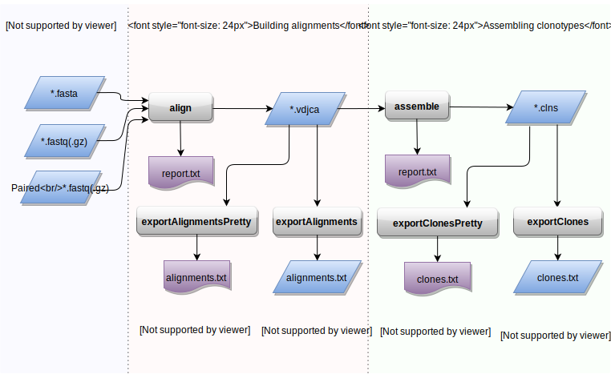

Quick start
==============

Overview
--------

Typical MiXCR workflow consists of three main processing steps:

-  :ref:`align <ref-align>`: align sequencing reads to reference V, D, J
   and C genes of T- or B- cell receptors
-  :ref:`assemble <ref-assemble>`: assemble clonotypes using alignments
   obtained on previous step (in order to extract specific gene regions
   e.g. CDR3)
-  :ref:`export <ref-export>`: export alignment (``exportAlignments``) or
   clones (``exportClones``) to human-readable text file

MiXCR supports the following formats of sequencing data: ``fasta``, ``fastq``, ``fastq.gz``, paired-end ``fastq`` and ``fastq.gz``. As an output of each processing stage, MiXCR produces binary compressed file with comprehensive information about entries produced by this stage (alignments in case of ``align`` and clones in case of ``assemble``). Each binary file can be converted to a human-readable/parsable tab-delimited text file using ``exportAlignments`` and ``exportClones`` commands.

Basic parameters
----------------

There are many parameters that user can change to adapt MiXCR for particular needs. While all these parameters are optional there is a set of parameters that are worth considering before running the analysis:

- ``-OvParameters.geneFeatureToAlign`` sets the gene feature of V gene used for alignment. Applied on the :ref:`alignment <ref-align>` stage. Choice of the value for this parameter depends on the type of starting material and library preparation strategy used. There are three options covering most of the cases (see :ref:`Gene Features <ref-geneFeatures>` for the full list):

  - ``VRegion`` **(default)** is generally suitable for majority of use cases, on the other hand if you have some additional information about your library it is a good idea to use one of the values mentioned below instead of default. Don't change the default value if your library is prepared using multiplex PCR on the V gene side.

  - ``VTranscript`` if RNA was used as a starting material and some kind of non-template-specific technique was used for further amplification on the 5'-end of RNA (e.g. 5'RACE) (see :ref:`example <ref-example5RACE>`). Using of this option is useful for increasing of sequencing information utilization from 5'-end of the molecule, which in turn helps to increase accuracy of V gene identification.

  - ``VGene`` if DNA was used as a starting material and 5' parts of V gene (including V intron, leader sequence and 5'UTR) are supposed to be present in your data. Using of this option is useful for increasing of sequencing information utilization from 5'-end of the molecule, which in turn helps to increase accuracy of V gene identification.

  Use ``VTranscript`` or ``VGene`` if you plan to assemble full-length clonotypes (including all FRs and CDRs) of T- or B- cell receptors.

- The ``-OassemblingFeatures`` parameter sets the region of TCR/BCR sequence which will be used to assemble clones. Applyed on the :ref:`assembly <ref-assemble>` stage. By default its value is ``CDR3`` which results in assembling of clones by the sequence of *Complementarity Determining Region 3*. To analyse full length sequences use ``VDJRegion`` as a value for the ``assemblingFeatures`` (see :ref:`Gene Features <ref-geneFeatures>` for more details).

- Another important parameter is ``--species``, it sets the target organism. This parameter is used on the :ref:`align <ref-align>` stage. Possible values are ``hsa`` (or ``HomoSapiens``) and ``mmu`` (or ``MusMusculus``). Default value is ``hsa``. This parameter should be supplied on the alignment stage (see :ref:`example <ref-exampleMouse>`).

The following sections describes common use cases

Examples
--------

Default workflow
^^^^^^^^^^^^^^^^

.. tip::
  Parameters used in this example are particularly suitable for analysis of **multiplex-PCR** selected fragments of T-/B- cell receptor genes.

MiXCR can be used with the default parameters in most cases by executing
the following sequence of commands:

.. code-block:: console

  > mixcr align input_R1.fastq input_R2.fastq alignments.vdjca

  ... Building alignments

  > mixcr assemble alignments.vdjca clones.clns

  ... Assembling clones

  > mixcr exportClones --chains IGH clones.clns clones.txt

  ... Exporting clones to tab-delimited file

The value of only one parameter is changed from its default in this snippet (``--chains IGH``) to tell MiXCR to export only IGH sequences. However even this parameter can be omitted (in this case MiXCR will export all T-/B- cell receptor sequences, that have been found in the sample).
 We reccomend always specify ``--chain`` parameter at the exportClones step.

The file produced (``clone.txt``) will contain a tab-delimited table with information about all clonotypes assembled by CDR3 sequence (clone abundance, CDR3 sequence, V, D, J genes, etc.). For full length analysis and other useful features see examples below.

.. _ref-example5RACE:

Analysis of data obtained using 5'RACE-based amplification protocols
^^^^^^^^^^^^^^^^^^^^^^^^^^^^^^^^^^^^^^^^^^^^^^^^^^^^^^^^^^^^^^^^^^^^

Consider MiXCR workflow in more detail on analysis of paired-end
sequenced cDNA library of IGH gene prepared using 5'RACE-based protocol
(i.e. onе read covers CDR3 with surroundings and another one covers
5'UTR and downstream sequence of V gene):

1. :ref:`Align <ref-align>` raw sequences to reference sequences of segments
   (V, D, J) of IGH gene:

  ::

    > mixcr align -OvParameters.geneFeatureToAlign=VTranscript \
      --report alignmentReport.log input_R1.fastq input_R2.fastq alignments.vdjca

  Here we specified non-default value for gene feature used to align V genes (``-OvParameters.geneFeatureToAlign=VTranscript``) in order to utilize information from both reads, more specifically to let MiXCR align V gene's 5'UTRS and parts of coding sequence on 5'-end with sequence from read opposite to CDR3. MiXCR can also produce report file (specified by optional parameter ``--report``) containing run statistics which looks like this:

  ::

    Analysis Date: Mon Aug 25 15:22:39 MSK 2014
    Input file(s): input_r1.fastq,input_r2.fastq
    Output file: alignments.vdjca
    Command line arguments: align --report alignmentReport.log input_r1.fastq input_r2.fastq alignments.vdjca
    Total sequencing reads: 323248
    Successfully aligned reads: 210360
    Successfully aligned, percent: 65.08%
    Alignment failed because of absence of V hits: 4.26%
    Alignment failed because of absence of J hits: 30.19%
    Alignment failed because of low total score: 0.48%

  One can convert binary output produced by ``align`` (``output.vdjca``) to a human-readable text file using :ref:`exportAlignments <ref-export>` command.

2. :ref:`Assemble <ref-assemble>` clonotypes:

  .. code-block:: console

    > mixcr assemble --report assembleReport.log alignments.vdjca clones.clns

  This will build clonotypes and additionally correct PCR and sequencing errors. By default, clonotypes will be assembled by CDR3 sequences; one can specify another gene region by passing additional command line arguments (see :ref:`assemble documentation <ref-assemble>`). The optional report ``assembleReport.log`` will look like:

  ::

    Analysis Date: Mon Aug 25 15:29:51 MSK 2014
    Input file(s): alignments.vdjca
    Output file: clones.clns
    Command line arguments: assemble --report assembleReport.log alignments.vdjca clones.clns
    Final clonotype count: 11195
    Total reads used in clonotypes: 171029
    Reads used, percent of total: 52.89%
    Reads used as core, percent of used: 92.04%
    Mapped low quality reads, percent of used: 7.96%
    Reads clustered in PCR error correction, percent of used: 0.04%
    Clonotypes eliminated by PCR error correction: 72
    Percent of reads dropped due to the lack of clonal sequence: 2.34%
    Percent of reads dropped due to low quality: 3.96%
    Percent of reads dropped due to failed mapping: 5.87%

3. :ref:`Export <ref-export>` binary file with a list of clones (``clones.clns``) to a human-readable text file:

  .. code-block:: console

    > mixcr exportClones --chains IGH clones.clns clones.txt

  This will export information about clones with default set of fields, e.g.:

  +-------------+----------------+-----+---------------------+--------------+-----------------+-----------------+-----+
  | Clone count | Clone fraction | ... | V hits              | J hits       | N. seq. CDR3    | AA. seq. CDR3   | ... |
  +=============+================+=====+=====================+==============+=================+=================+=====+
  | 4369        | 2.9E-3         | ... | IGHV4-39\*\00(1388) | IGHJ6        | TGTGTGAG...     | CVRHKPM...      | ... |
  |             |                |     |                     | \*\00(131)   |                 |                 |     |
  +-------------+----------------+-----+---------------------+--------------+-----------------+-----------------+-----+
  | 3477        | 2.5E-3         | ... | IGHV4-34\*\00(1944) | IGHJ4        | TGTGCGAT...     | CAIWDVGL...     | ... |
  |             |                |     |                     | \*\00(153)   |                 |                 |     |
  +-------------+----------------+-----+---------------------+--------------+-----------------+-----------------+-----+
  |      ...    |       ...      | ... |         ...         |      ...     |       ...       |       ...       | ... |
  +-------------+----------------+-----+---------------------+--------------+-----------------+-----------------+-----+

  where dots denote text not shown here (for compactness). For the full list of available export options see :ref:`export <ref-export>` documentation.

Each of the above steps can be customized in order to adapt the analysis pipeline for a specific research task (see below).

Full length IGH analysis
^^^^^^^^^^^^^^^^^^^^^^^^
For full length cDNA-based immunoglobulin repertoire analysis we generally recommend to prepare libraries with unique molecular identifiers (UMI) and sequence them using asymmetric paired-end 350 bp + 100 bp Illumina MiSeq sequencing (see Nature Protocols paper: http://www.nature.com/nprot/journal/v11/n9/full/nprot.2016.093.html). This approach allows to obtain long-range high quality sequencing and to efficiently eliminate PCR and sequencing errors using MiGEC software (https://milaboratory.com/software/migec/ ). 
We recommend  MiTools instrument (https://github.com/milaboratory/mitools) for merging paired-end reads (or UMI-based groups of reads).  
Merge subcommand with SumSubtraction quality merging algorithm:

  .. code-block:: console

    > java -jar mitools.jar  merge -s 0.7 -ss -r mitoolsReport.txt data_R1.fastq.gz data_R2.fastq.gz data_merged.fastq.gz

1. Alignment:

  We recommend using KAligner2 (http://mixcr.readthedocs.io/en/latest/newAligner.html) for the full length immunoglobulin profiling (currently in beta testing): 

  .. code-block:: console

    > mixcr align -p kaligner2 -r alignmentReport.txt -OjParameters.parameters.floatingRightBound=false -OvParameters.geneFeatureToAlign=VTranscript data.fastq.gz data.vdjca

  ``-OjParameters.parameters.floatingRightBound=false`` increases the accuracy of J gene identification if the library was amplified using primer annealing to the C region.

  Instead of KAligner2, default MiXCR aligner can be used as well, but it may miss immunoglobulin subvariants that contain several nucleotide-lengths indels within a V gene segment.

2. Assembling clones:

  .. code-block:: console

    > mixcr assemble -p default_affine -r assembleReport.txt -OassemblingFeatures=VDJRegion -OqualityAggregationType=Average -OminimalQuality=20 -OclusteringFilter.specificMutationProbability=1E-5 -OmaxBadPointsPercent=0 data.vdjca data.clns

  ``default_affine`` parameter is specifically required for the data aligned using KAligner2
  Set ``-OcloneClusteringParameters=null`` parameter to switch off the frequency-based correction of PCR errors.
  Depending on data quality, one can adjust input threshold by changing the parameter ``-ObadQualityThreshold``  to improve clonotypes extraction. 
  See “Assembler parameters” section of documentation for the advanced quality filtering parameters.

3. Export clones:
  
  .. code-block:: console

    >mixcr exportClones -o -t --chains IGH clones.clns clones.txt

  Options ``-o`` and ``-t``  filter off out-of-frame and stop codon containing clonotypes, respectively. Option ``--chains`` ``(-c)`` allows to set the name of chain to be exported (e.g. IGH, IGL)

.. _ref-exampleRnaSeq:

Analysis of RNA-Seq data
^^^^^^^^^^^^^^^^^^^^^^^^

MiXCR allows to extract immunological sequences from a large RNA-Seq datasamples. This can be done in the following way:

1. Alignment

.. code-block:: console

  > mixcr align -p rna-seq -f -OallowPartialAlignments=true -r alignmentReport.txt data_R1.fastq.gz data_R2.fastq.gz alignments.vdjca
All ``mixcr align`` parametrs are also suitable here (e.g. ``-s`` to specify organism). ``-OallowPartialAlignments=true`` option preserves partial alignments for their further use in assembly.

2. Assembling reads

.. code-block:: console

  > mixcr assemblePartial -r assembleReport.txt alignments.vdjca alignmentsRescued.vdjca

To obtain more assembled reads containing full CDR3 sequence it is recomended to perform several iterations of reads assembling using ``mixcr assemblePartial`` subcommand ``-p`` parameter is required for several iterations). In our experience, the best result is obtained after the second iteration:

.. code-block:: console

  > mixcr assemblePartial -p -r assembleReport.txt alignments.vdjca alignmentsRescued_1.vdjca
  > mixcr assemblePartial -p -r assembleReport.txt alignmentsRescued_1.vdjca alignmentsRescued_2.vdjca

3. Assembling clones

.. code-block:: console

  >mixcr assemble -OaddReadsCountOnClustering=true -ObadQualityThreshold=15 -r assembleClonesReport.txt alignmentsRescued_2.vdjca clones.clns

All ``mixcr assemble`` parametrs are also suitble here. For poor quality data it is recomended to decrease input quality threshold 
(``-ObadQualityThreshold``).

4.Export clones

.. code-block:: console

  >mixcr exportClones -c TRA  -o -t clones.clns clones.txt

One can specify immunological chain of interest to extract (``-c TRA`` or ``-c TRB``, etc.) and exclude out-of-frame (option ``-o``) and stop codon containing variants (option ``-t``).

Other parameters that can be modified are listed in the section “Processing RNA-Seq data”  of the MiXCR documentation: 
http://mixcr.readthedocs.io/en/latest/rnaseq.html

.. _ref-exampleMouse:

Assembling of CDR3-based clonotypes for mouse TRB sample
^^^^^^^^^^^^^^^^^^^^^^^^^^^^^^^^^^^^^^^^^^^^^^^^^^^^^^^^

This example shows how to perform routine assembly of clonotypes (based on CDR3 sequence) for mouse TRB library (aligning is performed for all possible genes - TRA/B/D/G and IGH/L/K, but only TRB clones are exported in the final table at the end).

.. code-block:: console

  > mixcr align --species mmu input_R1.fastq input_R2.fastq alignments.vdjca

Other analysis stages can be executed without any additional parameters:

.. code-block:: console

  > mixcr assemble alignments.vdjca clones.clns

  > mixcr exportClones --chains TRB clones.clns clones.txt

.. _ref-exampleBackwardLinks:

Saving links between initial reads and clones
^^^^^^^^^^^^^^^^^^^^^^^^^^^^^^^^^^^^^^^^^^^^^

In this example we demonstrate how to extract initial read headers for assembled clonotypes. On the ``align`` step additional ``--save-description`` option should be specified in order to store headers from reads in the resulting ``.vdjca`` file: 

.. code-block:: console

  > mixcr align --save-description input_R1.fastq input_R2.fastq alignments.vdjca

On the ``assemble`` stage it is necessary to specify file for the index (which stores mapping from reads to clonotypes):

.. code-block:: console

  > mixcr assemble --index indexFile alignments.vdjca clones.clns

Having this, it is possible to export original read headers with corresponding clone IDs:

.. code-block:: console

  > mixcr exportAlignments -cloneId indexFile -descrR1 -descrR2 alignments.vdjca alignments.txt

The resulting file ``alignments.txt`` will looks like:

+-----------+-----------------+-----------------+
| Clone ID  | Description R1  | Description R2  |
+===========+=================+=================+
|     10    | header_1_R1     | header_1_R2     |
+-----------+-----------------+-----------------+
|           | header_2_R1     | header_2_R2     |
+-----------+-----------------+-----------------+
|    2313   | header_3_R1     | header_3_R2     |
+-----------+-----------------+-----------------+
|   88142   | header_5_R1     | header_5_R2     |
+-----------+-----------------+-----------------+
|    ...    |     ...         |     ...         |
+-----------+-----------------+-----------------+
